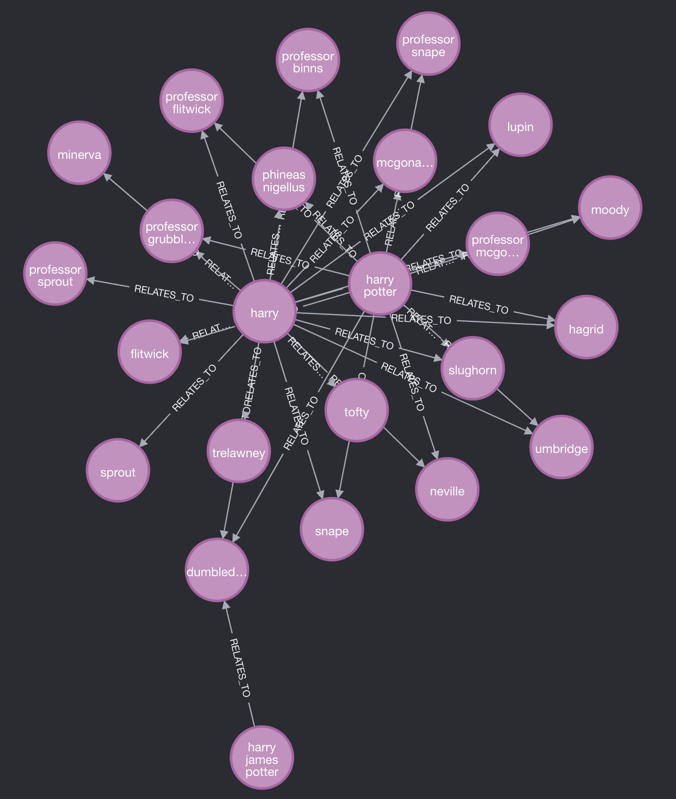
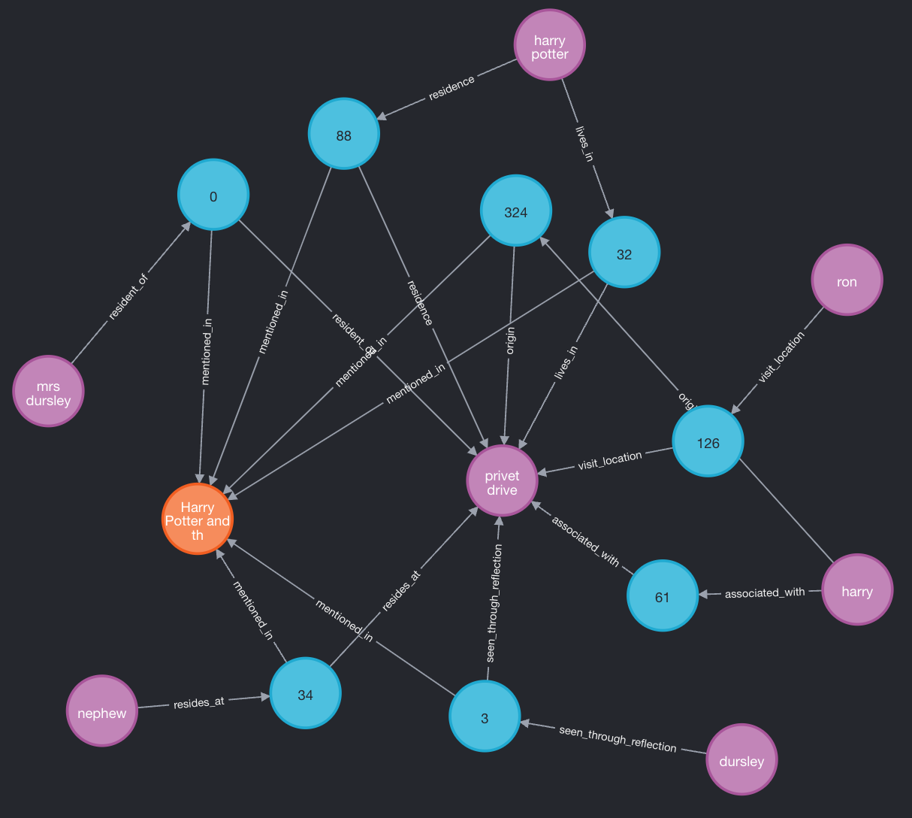

# Book Knowledge Graph Generator

[](https://www.python.org/downloads/)
[](https://python-poetry.org/)
[](https://neo4j.com/)
[](https://www.langchain.com/)
[](https://github.com/langchain-ai/langgraph)
[](https://ollama.ai/)

A tool to create knowledge graphs from books, extracting entities and their relationships to build a comprehensive Neo4j database. The project is demonstrated using Harry Potter books but is designed to work with any text. Microsoft's [GraphRAG](https://microsoft.github.io/graphrag/) project was the inspiration for this project.

## 📋 Overview

This project extracts entities (characters, objects, locations) and their relationships from books and organizes them into a knowledge graph using Neo4j. The system processes text using Langchain and Langgraph with Ollama's Llama3.1:8b model to identify connections between elements in the narrative.

## 🔧 Prerequisites

- Python 3.12+
- Poetry for dependency management
- Docker and Docker Compose for Neo4j
- Ollama with llama3.1:8b model (You can use any Ollama model of your choice)

## 🚀 Installation

1. Clone the repository:
   ```bash
   git clone git@github.com:shubham1chawla/genai-practice.git
   cd genai-practice/example-4/
   ```

2. Install dependencies using Poetry:
   ```bash
   poetry install
   ```

3. Pull the Llama3.1:8b model via Ollama:
   ```bash
   ollama pull llama3.1:8b
   ```

4. Create `.env` file with your Neo4j password. Look at `.env.example` file.

5. Start the Neo4j database:
   ```bash
   docker compose up -d
   ```

## 🏗️ Usage

1. Configure your books in the `books.json` configuration file:
   ```json
   [
       {
           "id": "<BOOK_ID>",
           "name": "<BOOK_NAME>",
           "url": "<BOOK_URL>"
       }
   ]
   ```

   Each book entry supports the following properties:
   - `id`: Unique identifier for the book
   - `name`: Full title of the book
   - `url`: URL to the PDF file
   - `start_page`: (Optional) Page number to start processing from
   - `end_page`: (Optional) Page number to stop processing at

2. Configure the build properties in [`build.py`](./build.py).

3. Run the build script to generate the knowledge graph:
   ```bash
   poetry shell
   python build.py
   ```

4. View the generated knowledge graph in the Neo4j browser:
   - Open http://localhost:7474
   - Login with default credentials (neo4j/password) or as configured in your `.env` file
   - Run Cypher queries to explore the data

## 📊 Example Queries

After generating the Harry Potter knowledge graph, try these example queries in Neo4j:

**Find all relationships involving Harry Potter and all professors**

```cypher
MATCH (e1:Entity)-[r1]-(d:Description)-[r2]-(e2:Entity)
WHERE e1.name =~ "harry(|.*potter)" AND "professor" IN e2.entity_types
WITH e1, e2, collect(d.content) as descriptions
RETURN e1, e2, apoc.create.vRelationship(e1, 'RELATES_TO', {descriptions: descriptions}, e2) as rel
```



**Find all entities related to the location Privet Drive in Harry Potter and the Philosopher's Stone**

```cypher
MATCH (b:Book)-[:mentioned_in]-(d1)-[]-(e1:Entity), (e1:Entity)-[]-(d2)-[]-(e2:Entity)
WHERE
b.id = "hp1" AND e1.name = "privet drive"
RETURN *
```



## 📊 Knowledge Graph Structure

The knowledge graph is structured with the following pattern:

```
(Entity 1)-[<EXTRACTED_RELATION>]->(Description)-[<EXTRACTED_RELATION>]->(Entity 2)
(Entity)-[DESCRIBED_AS]->(Description)-[MENTIONED_IN]->(Book)
```

Where:
- Entities can be characters, objects, locations, etc., dynamically extracted by the LLM
- Descriptions are contextual nodes that describe the entity or relationship
- Extracted relations are dynamically identified by the LLM
- Books are source nodes that track where entities and relationships were mentioned

This structure allows for rich querying of both direct entity relationships and the contextual information about how they relate to each other, as well as tracing relationships back to their source material.

## 🧩 Extending to Other Books

To use with different books:

1. Add your book information to the `books.json` file
2. Include the URL to the PDF and specify start/end pages
3. Run the build script as normal

## 🤝 Contributing

Contributions are welcome! Please feel free to submit a Pull Request.
