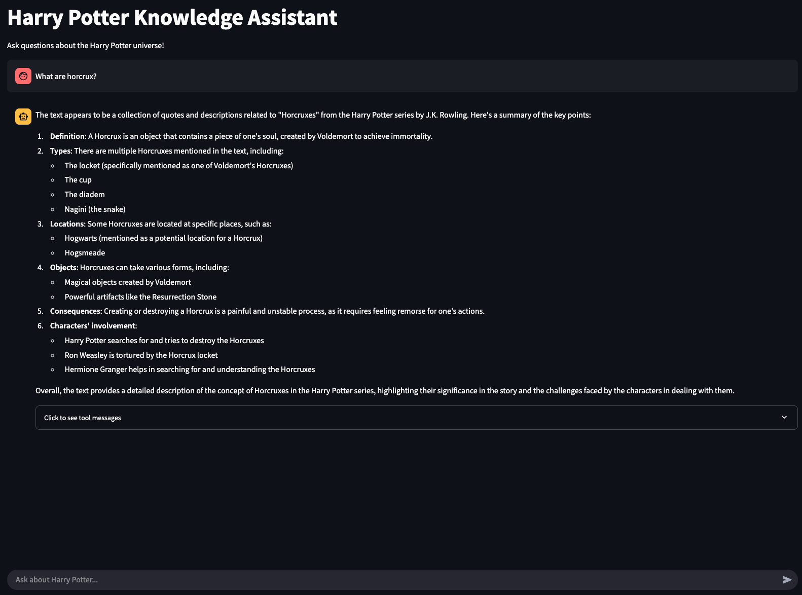
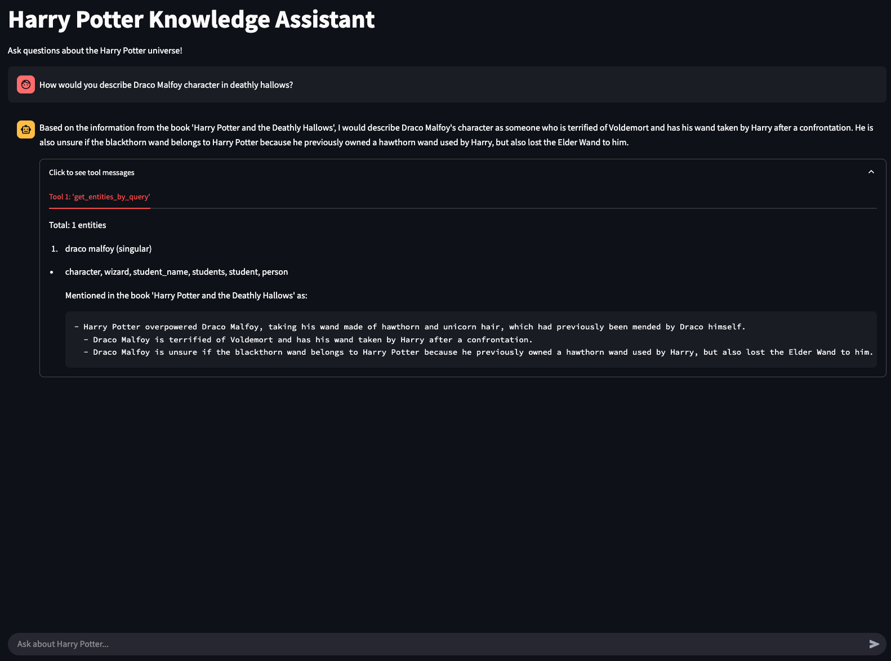
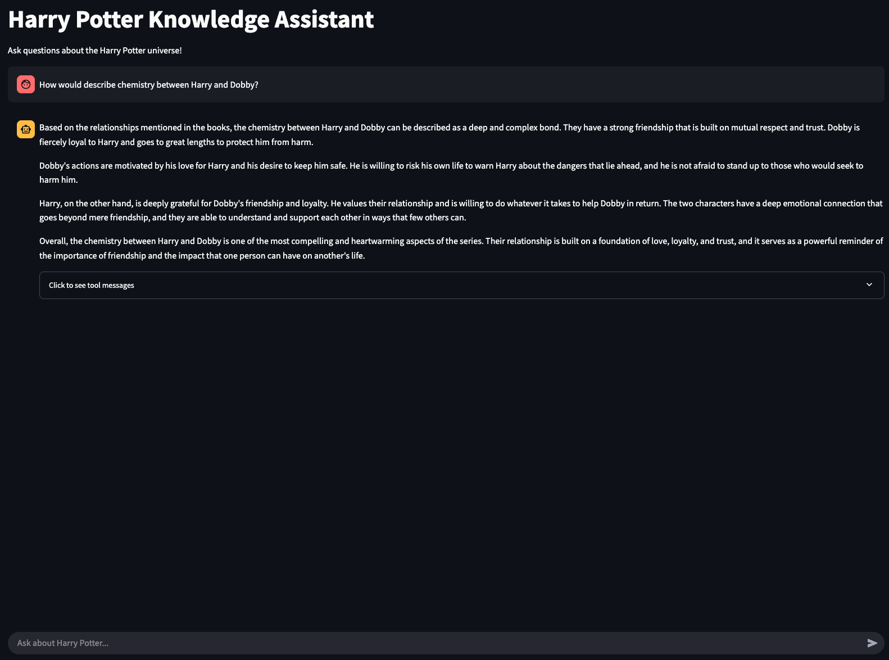

# Book Knowledge GraphRAG Agent

[](https://www.python.org/downloads/)
[](https://python-poetry.org/)
[](https://neo4j.com/)
[](https://www.langchain.com/)
[](https://github.com/langchain-ai/langgraph)
[](https://ollama.ai/)

A ReAct agent that retrieves information from a knowledge graph built from books, demonstrating Retrieval Augmented Generation (RAG) using graph-based knowledge representation. Building on our [Book Knowledge Graph Generator](link-to-previous-project), this project adds powerful query capabilities through a LangGraph-powered agent.

## 📋 Overview

This project implements the RAG (Retrieval Augmented Generation) component of GraphRAG, allowing users to query the knowledge graph generated from book content. The system uses a ReAct agent created with LangGraph's prebuilt module to intelligently query the Neo4j database, enabling natural language interactions with the structured knowledge.

## 🔧 Prerequisites

- Python 3.12+
- Poetry for dependency management
- Docker and Docker Compose for Neo4j
- Ollama with llama3.1:8b model
- A populated Neo4j database from the [Book Knowledge Graph Generator](../example-4)

## 🚀 Installation

1. Clone the repository:
   ```bash
   git clone git@github.com:shubham1chawla/genai-practice.git
   cd genai-practice/example-6/
   ```

2. Install dependencies using Poetry:
   ```bash
   poetry install
   ```

3. Pull the Llama3.1:8b model via Ollama:
   ```bash
   ollama pull llama3.1:8b
   ```

4. Create `.env` file with your Neo4j password. Look at `.env.example` file.

5. Ensure the Neo4j database is running:
   ```bash
   cd ../example-4/
   docker compose up -d
   ```
   
6. Generate the Neo4j database with Harry Potter. Check [Book Knowledge Graph Generator](../example-4) for instructions.

## 🏗️ Usage

### Running the Agent

To run the _Streamlit_ application -

```bash
poetry shell
streamlit run app.py
```

### Example Queries

1. _What are horcrux?_

   

2. _How would you describe Draco Malfoy character in deathly hallows?_

   

3. _How would describe chemistry between Harry and Dobby?_

   

## 🧠 Agent Architecture

This RAG agent is built using:

1. **LangGraph**: For creating a ReAct agent that performs reasoning, action selection, and observation
2. **Langchain**: To define tools that interface with the Neo4j database
3. **Ollama's Llama3.1:8b**: As the underlying language model for reasoning and response generation
4. **Neo4j**: As the graph database storing the knowledge extracted from books

The agent works by:
1. Receiving a natural language query
2. Using ReAct reasoning to determine which tool to use
3. Querying the Neo4j database with the appropriate tool
4. Processing the returned information
5. Providing a comprehensive response

## 🔍 Tool Descriptions

The agent provides three main tools to interact with the knowledge graph:

1. **get_books_by_query**: Find books by name

   Sample Cypher query:
   ```cypher
   MATCH (b:Book) WHERE b.name =~ $pattern RETURN b
   
   // $pattern = (?i)(|.*.)Harry.*.Potter(|.*.)
   ```

   Sample output for `query`: `Harry Potter`
   ```
   Total: 7 books

   1. Harry Potter and the Philosopher's Stone
   2. Harry Potter and the Chamber of Secrets
   3. Harry Potter and the Prisoner of Azkaban
   4. Harry Potter and the Goblet of Fire
   5. Harry Potter and the Order of the Phoenix
   6. Harry Potter and the Half-Blood Prince
   7. Harry Potter and the Deathly Hallows
   ```

2. **get_entities_by_query**: Find entities (characters, locations, objects) by name or type, optionally filtered by book

   Sample Cypher query:
   ```cypher
   MATCH (e:Entity)-[]-(d:Description)-[]-(b:Book)
   WHERE 
   (e.name =~ $entities_pattern OR ANY(type IN e.entity_types WHERE type =~ $entities_pattern))
   AND 
   b.name =~ $books_pattern
   return e, d, b
   
   // $entities_pattern = (?i)(|.*.)dobby(|.*.)
   // $books_pattern = (?i)(|.*.)chamber.*.of.*.secrets(|.*.)
   ```

   Sample output for `entity_query`: `dobby` and `book_query`: `chamber of secrets`
   ```
   Total: 1 entities

   dobby (singular)
   character, elf, house_elf, house-elf, character_name, characters, person
   
   Mentioned in the book 'Harry Potter and the Chamber of Secrets' as:
   
   - Dobby, a house-elf bound to serve Harry's family, warns him not to go back to Hogwarts after being sent by Malfoy.
   - Dobby is a house-elf bound to the Malfoy family, mistreated and enslaved, but he has also helped Harry in the past by saving him from harm at Hogwarts.
   - Dobby, a loyal and protective house-elf, is trying to get Harry Potter to say something as he remembers the time Dobby broke his arm to stop him from getting on the train.
   - Lucius Malfoy owns Dobby, a house-elf being tortured by Lucius, who comes to warn Harry about going back to Hogwarts.
   - Dobby, a house-elf bound to serve Harry's family, warns Harry about You Know Who while showing his bandaged fingers from an injury he sustained.
   - Dobby, a house-elf who was freed by Harry Potter, is warning him about the plot at Hogwarts while being tortured by Lucius Malfoy.
   - Dobby, a house-elf enslaved by Lucius Malfoy, visits Harry in his bedroom and tries to save him by getting him sent home.
   - Harry has a connection to Dobby, who is a house-elf trying to protect him from danger.
   - Dobby, a house-elf with powerful magic, visits Harry at night to warn him about You Know Who and tries to give him a hint about the Chamber of Secrets.
   - Dobby is a stammering, bound house-elf trying to protect Harry Potter from danger by telling him to go home.
   ```

3. **get_relationships_by_query**: Find relationships between entities

   Sample Cypher query:
   ```cypher
   MATCH (e1:Entity)-[r]-(d:Description)-[]-(e2:Entity), (d:Description)-[]-(b:Book)
   WHERE 
   (e1.name =~ $entity1_pattern OR ANY(type IN e1.entity_types WHERE type =~ $entity1_pattern))
   AND 
   (e2.name =~ $entity2_pattern OR ANY(type IN e2.entity_types WHERE type =~ $entity2_pattern))
   RETURN e1, e2, b, r, d
   
   // $entity1_pattern = (?i)(|.*.)ron(|.*.)
   // $entity2_pattern = (?i)(|.*.)malfoy(|.*.)
   ```

   Sample output for `entity1_query`: `ron` and `entity2_query`: `malfoy`
   ```
   Total: 7 relationships

   Relationship between ron (singular) & malfoy (singular)
   
   Mentioned in the book 'Harry Potter and the Prisoner of Azkaban' as:
   
   - Ron blamed Malfoy for the incident.
   - Ron laughs at the thought of Malfoy.
   - Ron defends himself against Malfoy's teasing.
   - Malfoy's cauldron was set up next to Ron, indicating they were preparing their ingredients on the same table.
   - Ron is concerned about the situation with Malfoy.
   - Ron was laughing at Malfoy's reaction to the ghost.
   - Ron is concerned about Malfoy's injury and asks how he is.
   - Malfoy teases Ron about fainting.
   
   Relationship type: laughing_at, tease, defend, concerned_about, is_concerned_about, blames, nearby, laughter_at
   
   ...
   ```

## 🔄 How It Works with the Knowledge Graph

This agent leverages the knowledge graph structure created in the previous project ([example-4](../example-4)):

```
(Entity 1)-[<EXTRACTED_RELATION>]->(Description)-[<EXTRACTED_RELATION>]->(Entity 2)
(Entity)-[DESCRIBED_AS]->(Description)-[MENTIONED_IN]->(Book)
```

The tools perform Cypher queries against this structure to retrieve relevant information based on user queries, which is then processed by the LLM to generate comprehensive responses.

## 🛠️ Extending the Agent

The agent can be extended in several ways:

1. Add new tools to query the graph in different ways
2. Implement memory to maintain conversation context
3. Add document retrieval capabilities to mix graph and vector-based retrieval
4. Integrate with different LLMs or providers

## 🤝 Contributing

Contributions are welcome! Please feel free to submit a Pull Request.

## 📚 Related Projects

- [Book Knowledge Graph Generator](../example-4): The companion project for generating knowledge graphs from books.
- [Microsoft GraphRAG](https://microsoft.github.io/graphrag/): The inspiration for this project.